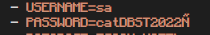

<p align="center">
  <a href="" rel="noopener">
 </a>
</p>

<h3 align="center">ESCOM HOTEL API</h3>

---


## 📝 Table of Contents

- [About](#about)
- [Getting Started](#getting_started)
- [Built Using](#built_using)
- [TODO](./TODO.md)
- [Authors](#authors)

## 🧐 About <a name = "about"></a>

API developed to provide functionalities to the ESCOM HOTEL Web App

## 🏁 Getting Started <a name = "getting_started"></a>

These instructions will get you a copy of the project up and running on your local machine for development and testing purposes. See [deployment](#deployment) for notes on how to deploy the project on a live system.

### Prerequisites

- [Docker](https://www.docker.com/) - Container
- Text editor or IDE (Recommended [Visual Studio Code](https://code.visualstudio.com/))
- Database Tool (Recommended [DBeaver](https://dbeaver.io/))
- [Postman](https://www.postman.com/)


### Installing

A step by step series of examples that tell you how to get a development env running.

- Clone this repository.
- Open a terminal in the project directory.
- Run the following command to switch to the api branch.

```
git checkout api-dev
```


Once we are in the api branch, we need to build up the necessary docker container to use our API.

- Run the following command in your terminal to setup the backend environment.


```
docker-compose up --build -d
```

After a while, the backend environment should be ready.


To check if the backend environment is ready, we will use Postman to send a request to the root endpoint

```
URL: localhost:5000/api/v1
```


Now, let's setup the databse. We will need to use DBeaver to connect to our DB.

- Click on the underlined button


- Select the SQL Server Option


- Install the Drivers

- Fill the DB Connection Form
  - Database credentials

  


- Check if the connection is done clicking in the underlined button.


- Click on the underlined button to finish the connection setup.


Now, let's create the ESCOM HOTEL Database.

- Right click in the DB connection, and select the underlined option or press F3 activate the shortcut.


- Copy the content of the init.sql file in the script body and click on the underlined
button.


- Copy the content of the functions.sql file in the script body and click on the underlined
button.


- Copy the content of the stored_procedures.sql file in the script body and click on the underlined
button.


- Copy the content of the population.sql file in the script body and click on the underlined
button.


To check that the API is working, let's login as admin.

- Open a new request in Postman, and configure it as follows:


- Click on the **Send button**. If everything is working, you will get a response.


- To stop the backend environtment run the following command:

```
docker-compose down
```


## ⛏️ Built Using <a name = "built_using"></a>

- [SQL Server ](https://www.microsoft.com/es-mx/sql-server/sql-server-2019) - Database
- [Flask](https://flask.palletsprojects.com/) - Server Framework
- [React](https://reactjs.org/) - Web Framework
- [Docker](https://www.docker.com/) - Container

<br>

<span></span>
<span> </span>
<span></span>
<span></span>

## ✍️ Authors <a name = "authors"></a>

- [@EdgarRamirezFuentes](https://github.com/EdgarRamirezFuentes) - API and Database development Team
